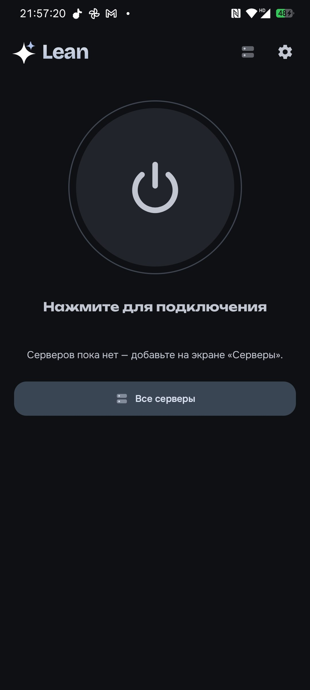
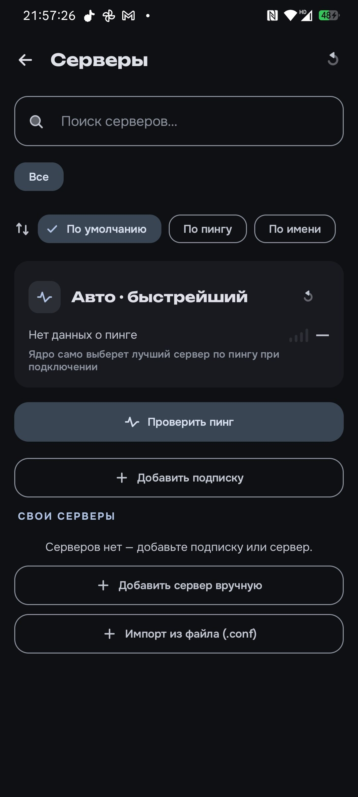
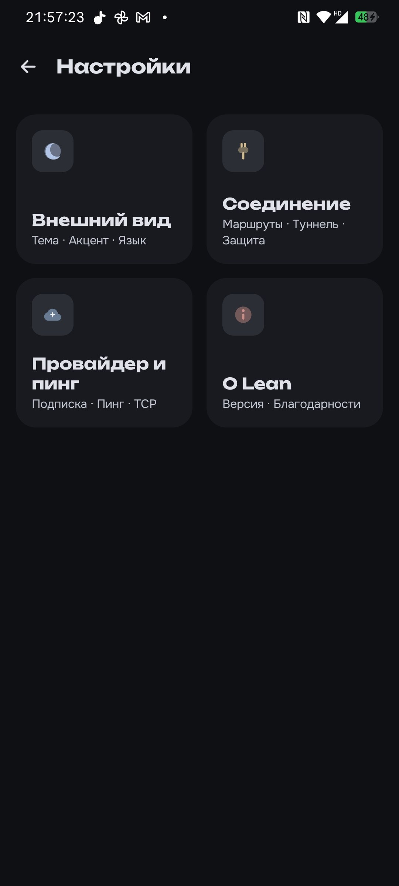
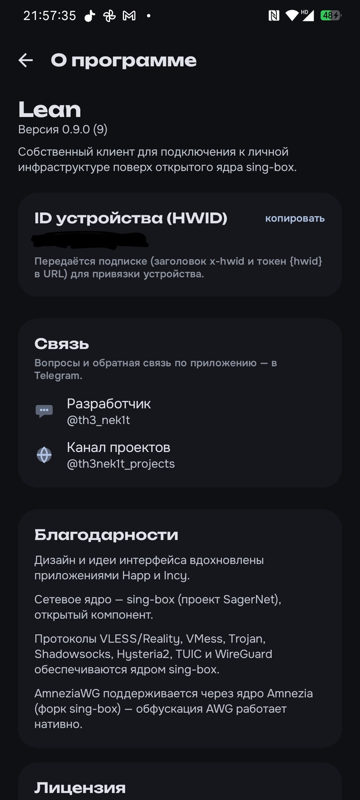

# Lean

**Быстрый VPN-клиент для Android. Обход блокировок без лишнего.**

[**⬇️ Скачать**](../../releases/latest) · [Канал проектов](https://t.me/th3nek1t_projects) · [Поддержка](https://t.me/th3_nek1t) · [Поддержать ₽](https://new.donatepay.ru/@1472897)

  
  
  
  

---

## Что это

Lean — лёгкий VPN-клиент для Android с упором на скорость и обход блокировок.
Никакой рекламы, аккаунтов и слежки — импортируешь подписку или конфиг и подключаешься.

## Возможности

- **Протоколы:** VLESS/Reality, VMess, Trojan, Shadowsocks, Hysteria2, TUIC, WireGuard, **AmneziaWG** (обход DPI).
- **Подписки** и share-ссылки, импорт `.conf`, deep-link `lean://`.
- **Темы** — тёмная / светлая / AMOLED, выбор цвета акцента, русский и английский.
- **Плитка** быстрых настроек, авто-выбор быстрейшего сервера, проверка пинга и сортировка.
- **Раздельный туннель** по приложениям, kill-switch, выбор DNS, обход локальной сети.
- **Маршрутизация** — режим «российские сайты напрямую» и свои rule-set'ы geoip/geosite.
- Мультиарх: `arm64-v8a`, `armeabi-v7a`, `x86_64` + универсальный APK.

## Скачать

Последняя сборка — на странице [**Releases**](../../releases/latest). Прямые ссылки:

| Архитектура | Для кого | APK |
|---|---|---|
| **arm64-v8a** | большинство современных телефонов | [скачать](https://github.com/Th3Nekit/Lean/releases/download/v0.9.4-beta/lean-0.9.4-arm64-v8a.apk) |
| armeabi-v7a | старые 32-битные устройства | [скачать](https://github.com/Th3Nekit/Lean/releases/download/v0.9.4-beta/lean-0.9.4-armeabi-v7a.apk) |
| x86_64 | эмуляторы, x86-планшеты | [скачать](https://github.com/Th3Nekit/Lean/releases/download/v0.9.4-beta/lean-0.9.4-x86_64.apk) |
| универсальный | если не знаешь архитектуру | [скачать](https://github.com/Th3Nekit/Lean/releases/download/v0.9.4-beta/lean-0.9.4-universal.apk) |

Не уверен — бери **универсальный**. После загрузки разреши установку из неизвестного
источника, открой APK, импортируй подписку или конфиг и подключайся.

> ⚠️ Только Android 7.0+. iOS не поддерживается.

## Поддержка

Вопросы и обратная связь — [@th3_nek1t](https://t.me/th3_nek1t).
Новости и сборки — [@th3nek1t_projects](https://t.me/th3nek1t_projects).

Lean бесплатный, без рекламы. Поддержать разработку — [donatepay.ru/@1472897](https://new.donatepay.ru/@1472897).

## Лицензия

Проприетарное ПО. Все права защищены. Распространяется только в виде APK; копирование,
модификация, реверс-инжиниринг и повторная публикация запрещены — см. [LICENSE](LICENSE).
